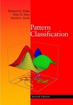

# [Learning Machine Learning](https://tommyod.github.io/lml/)

## What is this repository?

This repository documents my one-year journey to learn more about machine learning.
My personal opinion is that learning is best facilitated by reading great books written by experts in a field.
This approach guarantees that the source material is of sufficient quality, and avoids the potential pitfall of overemphasizing technology and implementation over ideas.

## Where are the solutions?

This repository contains notes and solutions to selected exercises in the following books:

- [Pattern Classification](https://www.amazon.com/Pattern-Classification-Pt-1-Richard-Duda/dp/0471056693) by Duda et al.  ([Notes and solutions](docs/duda_solutions.pdf)), October 2018 to Desember 2018

## How should the material be used?

The material is published here since it might provide value for others.
In no way are the notes and solutions meant as a replacement for purchasing the literature.
If you decide to look at the solutions, please make an honest attempt at solving the problem on your own first.
If you have **improvements or additional solutions, please contribute** by submitting a Pull Request to this repository.

## The reading list

### On the definite reading list

These are books that I will read to complete this project.

- [Pattern Classification](https://www.amazon.com/Pattern-Classification-Pt-1-Richard-Duda/dp/0471056693) by Duda et al.
- [Pattern Recognition and Machine Learning](https://www.amazon.com/Pattern-Recognition-Learning-Information-Statistics/dp/0387310738) by Bishop
- [Elements of Statistical Learning](https://www.amazon.com/Elements-Statistical-Learning-Prediction-Statistics/dp/0387848576) by Hastie et al.

### Up for consideration

These are books that I am currently considering purchasing.

- [Machine Learning: A Probabilistic Perspective](https://www.amazon.com/Machine-Learning-Probabilistic-Perspective-Computation/dp/0262018020) by Murphy et al.
- [Convex Optimization](https://www.amazon.com/Convex-Optimization-Corrections-2008-Stephen/dp/0521833787/) by Boyd et al, there are [lectures](https://web.stanford.edu/class/ee364a/) too.

Know of other good books? Let me know!
